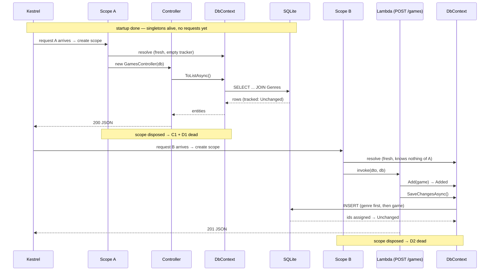
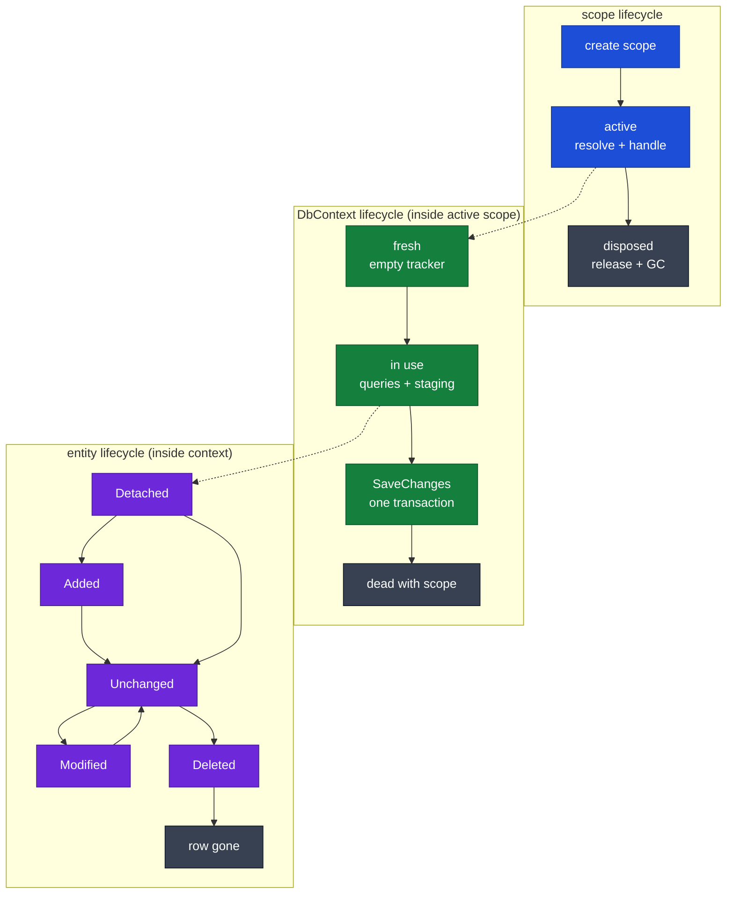
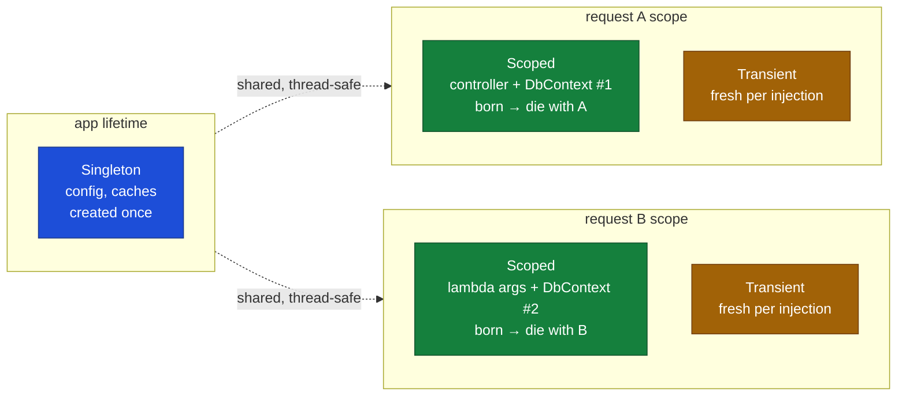
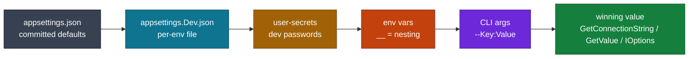
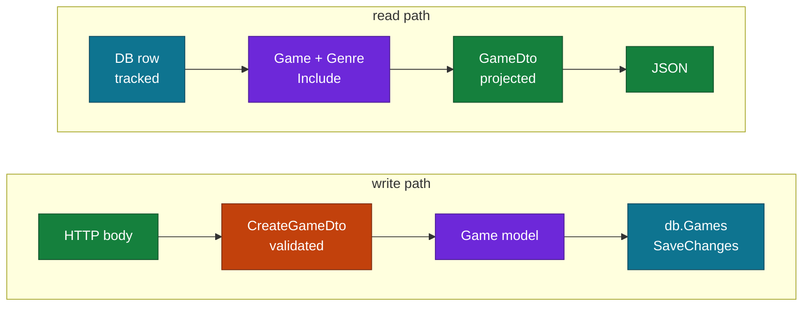

# NavNet — Full App Flow (startup → request → shutdown)

Companion sheets: `Dtos/VALIDATORS.md` (validation) · `Models/MODELS.md` (entities) ·
`Data/DBCONTEXT.md` (EF usage) · `CONFIG.md` (configuration). This file is the map; those are the territories.

## 0. Big picture

```
STARTUP (once)                REQUEST (per HTTP call)              SHUTDOWN (once)
──────────────                ─────────────────────              ──────────────
builder → services → app  →   Kestrel → middleware → routing  →   SIGTERM →
  → middleware → routes     →   scope → handler → EF → response      drain → dispose
```

### Visual flowchart (renders on GitHub; in VS Code install a Mermaid preview extension)

```mermaid
flowchart TD
    subgraph STARTUP["STARTUP — once"]
        direction TB
        B["builder = CreateBuilder<br/>config: json → secrets → env → CLI"] --> S1["AddControllers"]
        B --> S2["AddValidation"]
        B --> S3["AddDbContext = scoped"]
        S1 & S2 & S3 --> BUILD["app = Build<br/>container frozen"]
        BUILD --> R1["MapControllers<br/>scan actions via reflection"]
        BUILD --> R2["MapGamesEndpoints<br/>register 6 lambdas"]
        BUILD --> MIG["MigrateDb<br/>scope → migrate → seed → dispose"]
        R1 & R2 & MIG --> RUN["app.Run<br/>Kestrel listens :5204"]
    end

    RUN -->|HTTP request| MW["Middleware<br/>ExceptionPage → Routing → Auth"]

    subgraph REQUEST["REQUEST — per call, isolated scope"]
        direction TB
        MW --> SEL{"EndpointSelector<br/>one match?"}
        SEL -->|0 match| N404["404"]
        SEL -->|2+ match| A500["500 AmbiguousMatch"]
        SEL -->|1 match| SCOPE["new DI scope<br/>fresh scoped instances"]
        SCOPE --> MVC["MVC: new Controller + DbContext<br/>bind → validate → action"]
        SCOPE --> MIN["Minimal: build lambda args<br/>body + route + DI → invoke"]
        MVC --> EF["EF Core<br/>LINQ → SQL → track → SaveChanges"]
        MIN --> EF
        EF --> RESP["JSON response<br/>200 / 201 / 204 / 400 / 404"]
    end

    RESP -->|scope disposed| IDLE["ready for next request"]
    IDLE --> SHUT["SIGTERM → drain → dispose singletons → exit"]

    classDef start fill:#1d4ed8,color:#fff,stroke:#1e3a8a;
    classDef mvc fill:#15803d,color:#fff,stroke:#14532d;
    classDef min fill:#c2410c,color:#fff,stroke:#7c2d12;
    classDef db fill:#6d28d9,color:#fff,stroke:#4c1d95;
    classDef err fill:#b91c1c,color:#fff,stroke:#7f1d1d;
    classDef end fill:#374151,color:#fff,stroke:#111827;

    class B,BUILD,RUN start;
    class MVC,MW end;
    class MIN min;
    class EF,SCOPE,MIG db;
    class N404,A500 err;
    class RESP,IDLE,SHUT end;
    class STARTUP,REQUEST start;
```

## 1. Hosting — Kestrel and friends

Kestrel is the built-in cross-platform web server: holds the socket, parses HTTP, feeds your pipeline. `app.Run()` starts it (`localhost:5204` in dev).

```
dev:        Browser ──→ Kestrel (in-process) ──→ your app
prod:       Internet ──→ Nginx (TLS, filter, balance) ──→ Kestrel ──→ your app
legacy:     Internet ──→ IIS / Http.sys (Windows only) ──→ your app
```

Same code on all of them — you never pick a server in code.

## 2. Startup — `Program.cs` runs top to bottom, once

```csharp
var builder = WebApplication.CreateBuilder(args);   // ① config: appsettings → env → CLI
builder.Services.AddControllers();                  // ② register MVC machinery
builder.Services.AddValidation();                   //    register minimal-API validators
builder.Services.AddDbContext<AppDbContext>(...);   //    register DbContext as SCOPED
var app = builder.Build();                          // ③ container built — registrations frozen

app.MapControllers();                               // ④ discover controller actions (reflection, once)
app.MapGamesEndpoints();                            //    run your static method → register 6 lambdas
app.MapGet("/", ...);                               //    one more lambda
app.MigrateDb();                                    // ⑤ throwaway scope: Migrate() + seed, dispose scope
app.Run();                                          // ⑥ Kestrel listens (blocks until shutdown)
```

| File | Startup role |
|---|---|
| `Program.cs` | the whole sequence above |
| `Controllers/GamesController.cs` | type scanned, actions catalogued — no instance yet |
| `Endpoints/GamesEndpoints.cs` | `MapGamesEndpoints` executes, lambdas stored in route table |
| `Data/DataExtensions.cs` | `MigrateDb`: scope → migrate → seed → dispose |
| `Models/*`, `Dtos/*` | dormant (model used by EF to check schema; DTOs used per request) |

## 3. Request pipeline — same for both styles

```
Kestrel accepts socket
  → middleware in registration order (ExceptionPage → Routing → Auth → …)
  → EndpointSelector picks ONE match (ambiguity = 500)
  → NEW DI SCOPE created ──────────────────────┐
  → handler executes (2a MVC or 2b minimal)     │ scoped services live here
  → result → JSON response                      │
  → scope disposed ─────────────────────────────┘ (context + controller GC'd)
```

### 3a. MVC: `GET /api/Games/1`

```
scope → resolve AppDbContext (#1) → new GamesController(db #1)   // ctor injection, per request
  → model binding: 1 → int id (route)
  → [ApiController] validates input DTOs (POST/PUT/PATCH only)
  → action runs, await frees the thread until IO completes
  → ActionResult<GameDto> → 200 JSON
```

### 3b. Minimal: `POST /games`

```
scope → binding plan for this lambda: (CreateGameDto ← body, AppDbContext ← DI)
  → deserialize JSON → AddValidation() → invalid? 400 now, handler never runs
  → valid? invoke lambda(dto, db #2): genre lookup → Add → SaveChangesAsync
  → IResult → 201 JSON
```

The parameter list IS the injection request: undeclared = you don't get it. (Closures see outer
variables without declaring — fine for the old static list, fatal for a scoped DbContext.)

### 3c. Two concurrent requests = total isolation

Request A (`GET /api/...`, context #1, controller #1) and B (`POST /games`, context #2, lambda args)
share **nothing** except singletons (config, route table) and pooled connections.

## 3d. Class timeline — who lives when (two requests)



Entity (row object) states inside one context: `Detached` (new / not tracked) →
`Added` (after `Add`) → `Unchanged` (after load or save) → `Modified` (you edit a tracked
entity) → `Deleted` (after `Remove`). `SaveChanges` flushes Added/Modified/Deleted, then all
tracked entities return to `Unchanged`. Detached entities are invisible to it.

Scope states: `active` (resolving + handling) → `disposed` (release + GC). A disposed scope's
services must never be touched again.



## 3e. Worked example — start server, two calls, stop (colorful walkthrough)

```mermaid
flowchart TB
    P1["1 — dotnet run<br/>CreateBuilder reads json → env → CLI"]
    P2["2 — services registered<br/>Controllers + Validation + DbContext-scoped"]
    P3["3 — Build: container frozen<br/>MapControllers + MapGamesEndpoints register routes"]
    P4["4 — MigrateDb<br/>migrate schema, seed 8 genres + 8 games, dispose scope"]
    P5["5 — Kestrel listening :5204"]

    P6["6 — user: POST /games<br/>Hollow Knight / Metroidvania"]
    P7["7 — scope A born<br/>fresh DbContext A"]
    P8["8 — lambda invoked<br/>validate OK → genre missing → Add genre"]
    P9["9 — SaveChanges<br/>INSERT Genre 17, INSERT Game 9"]
    P10["10 — 201 Created<br/>scope A disposed"]

    P11["11 — user: GET /api/Games/1"]
    P12["12 — scope B born<br/>fresh DbContext B + new Controller"]
    P13["13 — action runs<br/>SELECT ... WHERE Id=1"]
    P14["14 — 200 Spacewar/Action<br/>scope B disposed"]

    P15["15 — Ctrl+C<br/>drain, dispose singletons, exit"]

    P1 --> P2 --> P3 --> P4 --> P5 --> P6 --> P7 --> P8 --> P9 --> P10
    P10 --> P11 --> P12 --> P13 --> P14 --> P15

    classDef boot fill:#1d4ed8,color:#fff,stroke:#1e3a8a;
    classDef post fill:#c2410c,color:#fff,stroke:#7c2d12;
    classDef get fill:#15803d,color:#fff,stroke:#14532d;
    classDef stop fill:#374151,color:#fff,stroke:#111827;
    class P1,P2,P3,P4,P5 boot;
    class P6,P7,P8,P9,P10 post;
    class P11,P12,P13,P14 get;
    class P15 stop;
```



Read it as the literal story: blue steps happen once at `dotnet run` (config → services → routes → seed → listen). Orange steps are the POST — scope A is born, the lambda validates, finds no "Metroidvania", stages genre + game, one `SaveChanges` writes both, 201 returns, scope A dies. Green steps are the GET — a brand-new scope B, controller, and context that know nothing of A; one SELECT; 200; scope B dies. Gray is shutdown. Every number maps to a real line: blue = `Program.cs` 5–19, orange = `GamesEndpoints.cs` MapPost + `DataExtensions.cs` seed pattern, green = `GamesController.cs` GetGame.

### Step-by-step, in plain words

**Blue — the server wakes up (once, no users yet).**

- **1.** `dotnet run` starts your program. `CreateBuilder` reads settings like stacking transparencies: `appsettings.json` at the bottom, then dev file, secrets, terminal env vars, CLI args on top. Whatever is on top wins.
- **2.** You hand the builder a shopping list of services: MVC machinery, the validation engine, and `AppDbContext` marked *scoped* (meaning: one fresh copy per future request). Nothing is created yet — only the list.
- **3.** `Build()` locks the list and builds the container. Then route registration: MVC scans `GamesController` with reflection and memorizes "GET /api/Games → GetGames…", while `MapGamesEndpoints()` runs your static method and memorizes six lambdas. Still zero requests served.
- **4.** `MigrateDb()` opens a short-lived scope (a mini-container just for startup), brings the schema up to date, inserts 8 genres + 8 games only if the tables are empty, then throws the whole scope away. This is the *only* time a context lives outside a request.
- **5.** Kestrel opens port 5204 and waits. The app now idles — memory holds singletons (config, route table) and nothing else.

**Orange — a user creates a game (request A).**

- **6.** `POST /games` arrives with Hollow Knight JSON. Kestrel hands it to routing, which matches exactly one lambda.
- **7.** A brand-new scope A is born. Inside it, a virgin `DbContext` A appears: connection closed, tracker empty, knows nothing about anything.
- **8.** The framework builds the lambda's arguments — DTO from the body, context from the scope — and calls it. Validation passes, so the handler looks up "Metroidvania", finds nothing, and stages a new `Genre` + new `Game` (both marked `Added`). Still zero SQL so far.
- **9.** `SaveChangesAsync` opens the connection, sends `INSERT Genre` first (it must exist before the game can point at it), then `INSERT Game`, all in one transaction, and closes the connection. Ids 17 and 9 come back and land on the objects.
- **10.** The lambda returns 201 + the new game JSON. Scope A is disposed — context A and everything it tracked vanish. The database remembers; memory forgets.

**Green — another user reads a game (request B, possibly the same millisecond).**

- **11.** `GET /api/Games/1` arrives. Totally separate envelope from request A.
- **12.** Scope B is born with virgin context B, and a virgin `GamesController` holding it. A and B share nothing — A could still be saving while B reads.
- **13.** The action runs one query: `SELECT ... FROM Games JOIN Genres ... WHERE Id = 1`. Rows become tracked objects (`Unchanged`), projected into a `GameDto`, and the entities are immediately irrelevant — only the DTO leaves the method.
- **14.** 200 with Spacewar/Action JSON. Scope B disposed — controller and context B gone.

**Gray — lights out.**

- **15.** Ctrl+C: Kestrel stops accepting new calls, finishes in-flight ones (about 30 seconds of grace), the container disposes singletons, the process exits. Your `games.db` file keeps everything; next start resumes at step 1.

The one idea underneath all fifteen steps: **each request gets a private room (scope) with fresh tools (context), does its job, and the room is demolished on the way out.** Nothing leaks between requests except through the database.

### Class-by-class: born, work, die

In C#, every object has three moments: **born** (constructor runs, `new` happens), **work** (you call its methods), **die** (disposed or garbage-collected). Here is each actor in our story:

**`WebApplication` (the builder, then the app) — born once, dies last.**
Born in `Program.cs` line 5 as a *builder* (a shopping list, not a server). You call `builder.Services.Add...` to fill the list, then `builder.Build()` transforms it into the *app* (line 12) — the real server object holding the DI container and the route table. It works the whole run (routing every request) and dies at Ctrl+C, disposing everything it owns. One birth, one death, application lifetime.

**`GamesController` — born per request, dies per request.**
Born when a request matches `/api/...`: the framework calls its constructor `GamesController(db)` — this exact line is the birth certificate — handing it that request's fresh context, which it keeps in a field. It works by running exactly one action method (`GetGame`, `CreateGame`…), then dies with its scope. A thousand requests = a thousand births and deaths; no controller ever sees two requests.

**`GamesEndpoints` — never born, never dies.**
It is `static`, so `new` is impossible and no constructor exists. `MapGamesEndpoints()` is just a chore function that runs once at startup to pin six lambdas to six routes, then is never called again. Think of it as a label on a toolbox, not a tool. The lambdas themselves aren't objects either — they're instructions the framework executes, receiving everything through parameters.

**`AppDbContext` — born per request (plus one cameo at startup), dies per request.**
Born two ways: at startup inside `MigrateDb`'s throwaway scope (migrate + seed, then die), and once per request inside that request's scope. Its constructor takes `DbContextOptions` (which database, which file) — the container supplies these automatically. It works by tracking entity objects and translating LINQ into SQL. It dies with its scope: connection returned to the pool, tracked entities released for garbage collection.

**`Game` / `Genre` (entities) — born per row, die with their context.**
Born when EF reads a database row (it calls the invisible default constructor and sets properties) or when you write `new Game { ... }`. They work by simply *holding data* — they have no methods, only properties. They die when their context is disposed; after that they are ordinary memory the garbage collector sweeps whenever it likes. Their *state* word (`Added`, `Unchanged`…) is not inside them — it lives in the context's tracker next to them.

**DTOs (`GameDto`, `CreateGameDto`…) — born per request, die per request.**
These are `record`s: born from JSON (deserialization calls the constructor with the body's values) or from your `new GameDto(...)` mapping lines. They work by carrying data across exactly one boundary — body→handler or handler→response. They die with the request. Unlike entities, nobody tracks them; after the response is written they are garbage.

```mermaid
flowchart LR
    subgraph BORN["born"]
        direction TB
        B1["Builder<br/>Program.cs:5"]
        B2["Controller<br/>per request"]
        B3["DbContext<br/>per request + startup"]
        B4["Entity / DTO<br/>per row / per boundary"]
    end
    subgraph WORK["work"]
        direction TB
        W1["holds container<br/>+ route table"]
        W2["one action<br/>method"]
        W3["track + SQL"]
        W4["hold data"]
    end
    subgraph DIE["die"]
        direction TB
        D1["Ctrl+C<br/>disposes all"]
        D2["scope end"]
        D3["scope end<br/>pool keeps connection"]
        D4["garbage<br/>collected"]
    end
    BORN --> WORK --> DIE

    classDef b fill:#1d4ed8,color:#fff,stroke:#1e3a8a;
    classDef w fill:#15803d,color:#fff,stroke:#14532d;
    classDef d fill:#374151,color:#fff,stroke:#111827;
    class B1,B2,B3,B4 b;
    class W1,W2,W3,W4 w;
    class D1,D2,D3,D4 d;
```



The odd one out is deliberate: everything is born to die with its request — except `GamesEndpoints`, which is never born at all, and `WebApplication`, which outlives everything.

## 4. Service lifetimes — how long instances live



```
Singleton  │●────────────────────────────── app lifetime ──────────────────────────────●│
Scoped     │  ●── request A ──●  ●── request B ──●                                        │
Transient  │  ● ● ●               ● ●                                                    │ per injection
```

```csharp
builder.Services.AddSingleton<ICache, MemoryCache>();      // one forever: config, caches
builder.Services.AddScoped<IRepo, GameRepo>();             // one per request (DbContext lives here)
builder.Services.AddTransient<IValidator, GameValidator>(); // new every injection
```

Rules: never inject scoped/transient into a singleton (**captive dependency** — stale context, leaks);
never store a scoped `db` in a static field. `MigrateDb` manufactures its own scope because no
request exists at startup.

## 5. Configuration layers (later wins →)



```
appsettings.json → appsettings.{Env}.json → user-secrets (Dev) → env vars (__ = :) → CLI args
```

```csharp
GetConnectionString("Games")          // ConnectionStrings:Games
GetValue<int>("GameStore:PageSize")    // nested key, optional fallback
Configure<Opts>(GetSection("..."))    // 3+ related values → IOptions<T>
```

Terminal: `PricingApi__Key="x" dotnet run ...` (one command) or `export` (session) or
`--PricingApi:Key "x"` (beats env). Sections override leaf-by-leaf; swap whole files per env instead.

## 6. Data — model vs DTO vs table



```
HTTP body → CreateGameDto (validated) → new Game (model) → db.Games.Add + SaveChanges
DB row    → Game (tracked) → new GameDto (projected) → JSON response
```

- Model (`Game`/`Genre`): what the DB stores. `Id` = PK + autoincrement by convention.
- DTO: what clients may send/receive. Validation lives here, never on the model.
- `DbSet<T>`: the table handle — query (LINQ) + staging area; nothing writes until `SaveChanges`.
- Migrations: `migrations add X` scaffolds the diff; `database update` applies it; snapshot is tool-owned.

## 7. Shutdown

```
Ctrl+C / SIGTERM → app.Run() unblocks
  → Kestrel stops accepting, drains in-flight requests (~30s grace)
  → container disposed → singletons disposed → process exits
```

## 8. Where things broke (debugging memory)

| Symptom | Cause | Fix applied |
|---|---|---|
| 500 `AmbiguousMatchException` | `/Games` vs `/games` match case-insensitively | controller → `api/[controller]` |
| `FOREIGN KEY constraint failed` at seed | `sqlite_sequence` gap (deleted rows keep counter) | resolve genre Ids by name |
| `Unable to retrieve project metadata` | `--project` path relative to wrong cwd | run from owning dir / omit flag |
| `dotnet-ef` not found | global tools dir not on PATH | `export PATH="$PATH:$HOME/.dotnet/tools"` |
| Stale app on port (mystery 404/500) | old `dotnet run` still holding 5204 | `pkill -f NavNet.dll` before rerun |
