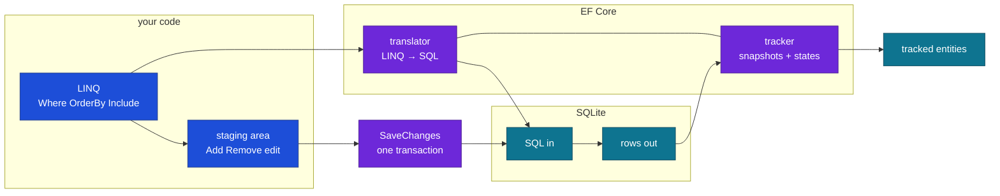
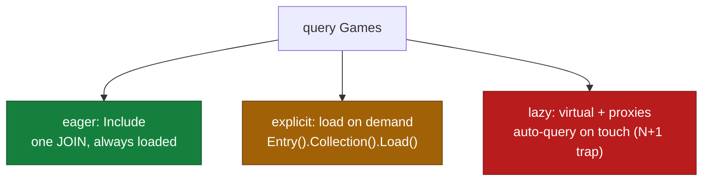
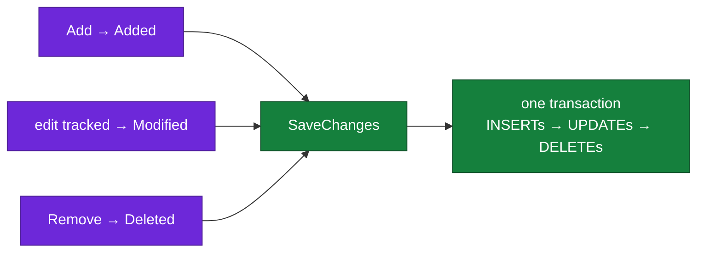

# EF Core `DbContext` / `DbSet` — Cheat Sheet (for `NavNet/Data`)

Diagrams are mermaid (GitHub-native; VS Code needs a preview extension).

## 0. The mental model



Three parts: **query builder** (LINQ, lazy until executed), **change tracker** (remembers what's loaded/changed), **saver** (`SaveChanges` writes everything in one transaction).

## 1. `DbSet<T>` — your typed table handle

```csharp
public DbSet<Game> Games => Set<Game>();
```

One per table you touch directly (`Games`, `Genres`). Skip it only for hidden many-to-many link tables. Alternative without the property: `db.Set<Game>()`.

## 2. Reading — query shapes

```csharp
db.Games.ToList();                          // all rows
db.Games.Find(5);                           // by PK (checks memory first, fast)
db.Games.First(g => g.Id == 5);             // throws if missing
db.Games.FirstOrDefault(g => g.Id == 5);    // null if missing
db.Games.SingleOrDefault(g => g.Name == "Doom"); // null, throws if 2+ match
db.Games.Where(g => g.Price < 20);          // filter (IQueryable — lazy, no SQL yet!)
db.Games.OrderBy(g => g.Name);              // sort (.OrderByDescending)
db.Games.Skip(10).Take(10);                 // paging: page 2, size 10
db.Games.Count();                           // SELECT COUNT(*)
db.Games.Any(g => g.Price < 0);             // EXISTS check (cheapest existence test)
db.Games.Max(g => g.Price);                 // aggregates: Min / Average / Sum
db.Games.Select(g => g.Name);               // single column only
db.Games.Select(g => new GameDto(...));     // project straight to DTO (best practice)
```

Execution rule: `Where`/`OrderBy`/`Skip`/`Select` **build**; `ToList`/`First`/`Count`/`Any` **execute**. Chain freely — still one round trip.

## 3. Loading related data — three strategies



```csharp
// EAGER (default choice): one SQL with JOIN
db.Games.Include(g => g.Genre).ToList();
db.Genres.Include(g => g.Games).ThenInclude(g => g.Genre).ToList(); // nested

// EXPLICIT: load later, second round trip
var game = await db.Games.FindAsync(id);
await db.Entry(game).Reference(g => g.Genre).LoadAsync();

// LAZY: needs proxies + virtual — OFF in NavNet (good). Each touch = hidden query.
// 8 games × genre touch = 9 queries (N+1). Prefer Include.
```

## 4. Writing — staged until saved



```csharp
db.Games.Add(game);                         // INSERT on save
db.Games.AddRange(games);                   // bulk insert
db.Games.Remove(game);                      // DELETE on save
db.Games.Update(game);                      // UPDATE all columns (detached DTO → entity)
db.Entry(game).State = EntityState.Modified; // same, explicit
db.SaveChanges();                           // flush everything in ONE transaction
```

Entity states: `Detached` (invisible) → `Added` / `Unchanged` (loaded/saved) → `Modified` (edited) → `Deleted`. Save writes Added/Modified/Deleted, resets survivors to `Unchanged`.

## 5. Async variants (use in endpoints/controllers)

```csharp
await db.Games.ToListAsync();
await db.Games.FindAsync(5);
await db.Games.FirstOrDefaultAsync(g => g.Id == 5);
await db.SaveChangesAsync();
```

ASP.NET is async-first: `*Async` frees the thread during DB I/O so one server handles thousands of concurrent requests.

## 6. `DbContext` members beyond `DbSet`

```csharp
db.SaveChanges() / SaveChangesAsync()  // persist staged changes
db.Set<Game>()                         // DbSet for any entity (no property needed)
db.Entry(game)                         // tracking info: .State, .OriginalValues, .Reload()
db.Database.EnsureCreated()            // create schema, NO migrations (prototypes only)
db.Database.Migrate()                  // apply migrations at runtime (your MigrateDb)
db.Database.BeginTransaction()         // manual multi-save transaction
db.Games.FromSql($"SELECT * FROM Games WHERE Price < {x}") // raw SQL query
db.Database.ExecuteSql($"DELETE FROM Games WHERE ...")    // raw SQL command
```

## 7. Transactions — when one `SaveChanges` isn't enough

```csharp
await using var tx = await db.Database.BeginTransactionAsync();
try
{
    db.Games.Add(game);
    await db.SaveChangesAsync();
    db.Genres.Remove(oldGenre);
    await db.SaveChangesAsync();
    await tx.CommitAsync();
}
catch { await tx.RollbackAsync(); throw; }
```

One `SaveChanges` already wraps itself in a transaction — reach for explicit ones only when spanning multiple saves or mixing SQL.

## 8. Concurrency — two users edit the same row

Last-write-wins by default (silent overwrite). Opt into a fight detector:

```csharp
[Timestamp] public byte[] RowVersion { get; set; } = null!;  // model
// or: modelBuilder.Entity<Game>().Property(g => g.Name).IsConcurrencyToken();
```

```csharp
try { await db.SaveChangesAsync(); }
catch (DbUpdateConcurrencyException)
{
    // someone else saved first: reload, merge, retry or return 409 Conflict
}
```

## 9. Performance checklist

- `AsNoTracking()` on pure reads (dropdowns, lists) — skips snapshot overhead.
- Project to DTOs (`Select`) instead of `Include` + full entities when you need few columns.
- `AsSplitQuery()` when an `Include` fans out into a giant cartesian JOIN.
- `ExecuteUpdate` / `ExecuteDelete` (EF7+): bulk write without loading rows first.
- Index FKs and filter columns (`HasIndex`); check the SQL with `ToQueryString()`.

```csharp
db.Games.Where(g => g.Price < 20).ToQueryString();  // see the SQL without running it
await db.Games.Where(g => g.Price < 1).ExecuteDeleteAsync(); // DELETE without SELECT
```

## 10. Migrations workflow

```zsh
dotnet ef migrations add <Name> --output-dir Data/Migrations  # scaffold diff
dotnet ef migrations remove                                   # undo last (only if unapplied)
dotnet ef database update                                     # apply to games.db
dotnet ef migrations script --output migrate.sql              # SQL for prod pipelines
```

Snapshot + `*.Designer.cs` are tool-owned — never hand-edit. You own models + `OnModelCreating`.

## 11. Full flow — your game

```csharp
// CREATE: DTO (validated) → model → stage → save (Id auto-assigned)
var game = new Game { Name = dto.Name, GenreId = dto.GenreId, Price = dto.Price, ReleaseDate = dto.ReleaseDate };
db.Games.Add(game);
await db.SaveChangesAsync();   // game.Id now set

// READ: model → DTO (never return the entity directly)
var dto = await db.Games.Where(g => g.Id == id)
    .Select(g => new GameDto(g.Id, g.Name, g.GenreId, g.Price, g.ReleaseDate))
    .FirstOrDefaultAsync();

// UPDATE: fetch → mutate → save (tracking detects the diff)
var game = await db.Games.FindAsync(id);
game.Price = dto.Price;
await db.SaveChangesAsync();

// DELETE
db.Games.Remove(game);
await db.SaveChangesAsync();
```

## 12. Recipes on your stuff (Game + Genre)

```csharp
// genre dropdown for a form: id + name pairs, read-only
var genres = await db.Genres.AsNoTracking()
    .OrderBy(g => g.Name)
    .Select(g => new { g.Id, g.Name })
    .ToListAsync();

// games in a genre, cheapest first, page 1 of 10
var page = await db.Games.AsNoTracking()
    .Where(g => g.Genre.Name == "FPS")
    .OrderBy(g => g.Price)
    .Skip(0).Take(10)
    .Select(g => new GameDto(g.Id, g.Name, g.GenreId, g.Price, g.ReleaseDate))
    .ToListAsync();

// find-or-create genre by name (used in POST/PUT/PATCH)
var genre = await db.Genres.FirstOrDefaultAsync(g => g.Name == name)
    ?? db.Genres.Add(new Genre { Name = name }).Entity;

// rename a genre: load WITH its games to see the blast radius
var genre = await db.Genres.Include(g => g.Games).FirstAsync(g => g.Id == id);
genre.Name = "First-Person Shooter";   // games follow automatically (same row)
await db.SaveChangesAsync();

// move a game to another genre (FK reassignment, no genre edit)
var game = await db.Games.FindAsync(gameId);
game.GenreId = rpgId;
await db.SaveChangesAsync();

// delete a genre WITH its games (cascade is on: deleting genre deletes its games!)
var genre = await db.Genres.FindAsync(id);
db.Genres.Remove(genre);
await db.SaveChangesAsync();

// count per genre (GROUP BY)
var counts = await db.Games
    .GroupBy(g => g.Genre.Name)
    .Select(g => new { Genre = g.Key, Count = g.Count() })
    .ToListAsync();
```

> Cascade warning: `Games.GenreId` is `onDelete: Cascade` — deleting a `Genre`
> deletes its `Game`s. To block that: `OnModelCreating` →
> `modelBuilder.Entity<Game>().HasOne(g => g.Genre).WithMany(g => g.Games)`
> `.OnDelete(DeleteBehavior.Restrict)` + new migration.

## 13. Rules of thumb

- Query with LINQ, never string-concat SQL (injection-safe by default).
- `Find` for PK lookup, `FirstOrDefault` + null-check otherwise.
- `Include` navigations you read; `AsNoTracking` for pure reads.
- One `SaveChanges` per request = one transaction.
- Return DTOs, not entities (avoids lazy-load surprises + over-posting).

## 14. Why map to a DTO — step by step with your classes

Your two model classes (`Models/Game.cs:3-11`, `Models/Genre.cs:5-13`):

```csharp
class Game  { int Id; string Name; int GenreId; Genre Genre; ... }
class Genre { int Id; string Name; List<Game> Games; }
```

Notice: the relationship exists **twice** in C# — once as an int (`GenreId`),
once as objects (`Genre` / `Games`). The database stores only the int.
The objects are a convenience wrapper EF builds in memory by JOINing.

### Step 1 — what is actually in memory after your POST?

`Endpoints/GamesEndpoints.cs:29-43`: `AnyAsync` answers true/false, it does
NOT load any row. So after `SaveChanges`:

```
game.GenreId = 16          // real value, from the column
game.Genre   = null        // nothing was ever loaded, so nothing to link
```

Returning `game` here would serialize as `{"genre": null}` — a leaked
internal detail that contradicts `genreId: 16`.

### Step 2 — what if the navigation IS loaded?

Say a GET does `Include(g => g.Genre)` plus the genre's `Games` list.
Now memory holds real references, and they point back at each other —
not copies, the *same* objects:

```
game  ──Genre──> genre { Id: 16, Name: "Puzzle" }
genre ──Games──> [ game, otherGame, ... ]   // Games[0] IS game, same address
```

### Step 3 — what the JSON serializer does

`System.Text.Json` has one rule: walk every public property; if a property
is an object or list, walk inside it too. Traced on the loaded graph:

```
1. write game.Id, game.Name, game.GenreId       // flat values, fine
2. see game.Genre (object) → step inside
3. write genre.Id, genre.Name                    // fine
4. see genre.Games (list) → step into Games[0]
5. Games[0] IS game → back to step 1… forever
```

It detects the loop and throws (`A possible object cycle was detected`) →
500 instead of 201. Without a loop it still dumps the neighborhood: one
game request returns its genre plus every other game in that genre.

### Step 4 — why the DTO ends the walk

```csharp
new GameDto(game.Id, game.Name, game.GenreId, game.Price, game.ReleaseDate)
// {"id":9,"name":"Hollow Knight","genreId":16,...} — ints/strings only,
// no object property to follow, so the walk stops after one level.
```

Rule: entities are for the database (relationships as objects); DTOs are
for the wire (relationships as ids). The mapping line converts worlds.
