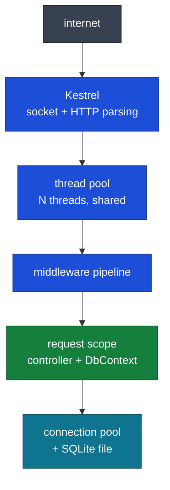
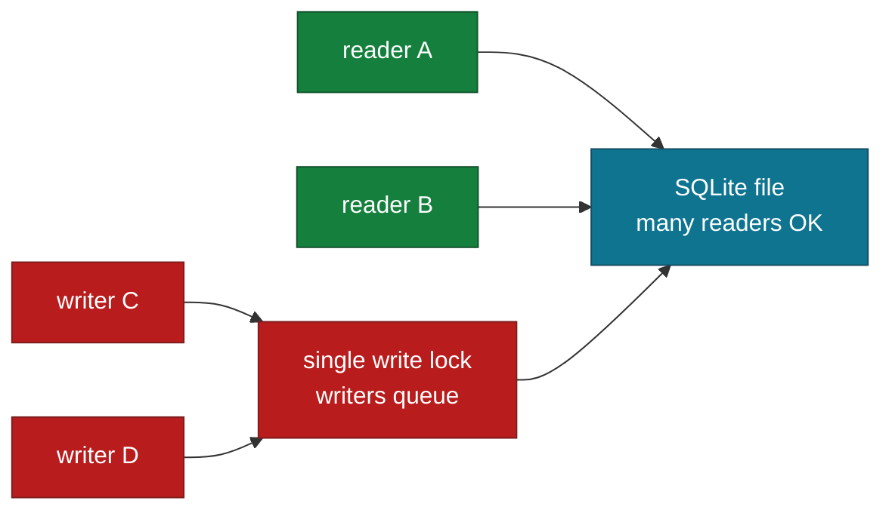

# How this webapp works — threads, memory, concurrency (for `NavNet`)

Diagrams are mermaid (GitHub-native; VS Code needs a preview extension).

## 0. One picture



## 1. Threading — no thread per request is blocked

Kestrel + ASP.NET run on the .NET **thread pool** (roughly CPU-count × threads, grows as needed).
The key trick is `async`/`await`:

```
request arrives → pool thread T7 starts handler
  → handler hits await db.ToListAsync() → T7 RETURNED to pool (free for others)
  → DB answers → ANY free thread resumes the handler (maybe T12, not T7)
  → response written
```

So 10,000 concurrent requests do NOT need 10,000 threads — they need ~10,000 small state
machines parked on I/O, and a few dozen threads servicing whichever completes. Blocking calls
(`.Result`, `.Wait()`, sync `ToList()` on a hot path) defeat this by pinning a thread doing
nothing — that's why every handler here uses `*Async`.

Rule: **never block on async code; never do CPU marathons on request threads** (offload with
`Task.Run` only for genuine CPU work, and even then sparingly).

## 2. Memory — GC generations and who allocates what

.NET manages memory with a **generational GC**:

```
gen 0 (newborns: DTOs, middleware buffers) → die young, collected in ms
gen 1 (survivors of one collection: active request state)
gen 2 (long-lived: singletons, route table, pooled buffers) → rarely collected, pauses cost most
LOH (large objects ≥85KB: big JSON payloads) → collected with gen 2, can fragment
```

Per-request flow in NavNet:

| Object | Generation fate |
|---|---|
| DTOs, JSON buffers | gen 0 — dead after response |
| Controller, `DbContext`, tracked entities | gen 0/1 — dead at scope dispose |
| Route table, config, singletons | gen 2 — live forever (small, fine) |
| Pooled sockets/buffers (Kestrel) | reused, never GC'd (good) |

The change tracker is the main memory lever: every entity loaded into a context is snapshotted
(original values kept for diffing). Long-lived contexts = ever-growing snapshots = leak-shaped
growth. Scoped-per-request contexts bound this to one request. `AsNoTracking()` skips snapshots
entirely for pure reads.

## 3. Disposal — deterministic cleanup vs GC

Two cleanup systems, different jobs:

- **`IDisposable` (deterministic):** scopes, `DbContext`, connections. `using`/`await using` runs
  cleanup *now* — connection back to pool, scope emptied. Request scopes dispose automatically.
- **GC (non-deterministic):** plain objects (DTOs, strings). You drop references; the collector
  reclaims *later*. No action needed, no timing guaranteed.

```csharp
using var scope = app.Services.CreateScope();  // deterministic: disposed at } (your MigrateDb)
var dto = new GameDto(...);                    // GC: forgotten after response, swept in ms
```

If it's scarce/shared (connection, file, lock) → `IDisposable`. If it's just memory → let the GC work.

## 4. DI scopes — the concurrency unit

```
singleton (config) ─── shared by ALL requests, must be thread-safe (no mutable state)
scoped (DbContext, controller) ─── ONE INSTANCE PER REQUEST, never shared, never stored
transient ─── fresh per injection, dies with its owner
```

Two requests = two scopes = two of everything scoped. The framework enforces the boundary:
resolving scoped-from-singleton throws; storing scoped-in-static compiles but corrupts
(thread collisions + stale data). Your `MigrateDb` builds its own scope because no request
exists at startup.

## 5. SQLite concurrency — the bottleneck you own

Unlike Postgres/SQL Server, SQLite has **one writer at a time** (file-level lock; WAL mode lets
readers proceed during a write, which `Microsoft.Data.Sqlite` enables patterns for — but writes
still serialize).



Consequences for NavNet:

- Reads scale fine; concurrent writes queue (each `SaveChanges` is quick, so this only bites under real load).
- `database is locked` errors appear when a write waits longer than the busy timeout — keep transactions short (one `SaveChanges`, no user input inside).
- Never share one connection/context across threads (pool gives each scope its own).
- Outgrowing SQLite = switching provider (`UseNpgsql`/`UseSqlServer`), same LINQ, new migration for type differences.

## 6. Scaling story

```
one process (now) → more threads (free via async) → more processes behind Nginx
  → SQLite becomes the ceiling (single writer) → Postgres (many writers)
```

Your code is already shaped for this: stateless handlers + per-request scopes + pooled connections
mean new instances share nothing except the database. The day one box isn't enough, the app moves
without rewrites — only the connection string changes (see `CONFIG.md`).

## 7. Rules of thumb

- `await` all I/O; never `.Result`/`.Wait()` on a request path.
- Keep scopes short: resolve, use, dispose — the framework does this per request automatically.
- `AsNoTracking` + DTO projection on reads; track only what you intend to write.
- One `SaveChanges` per request; explicit transactions only across multiple saves.
- SQLite: many readers fine, one writer at a time, short transactions, migrate provider when writes queue.
